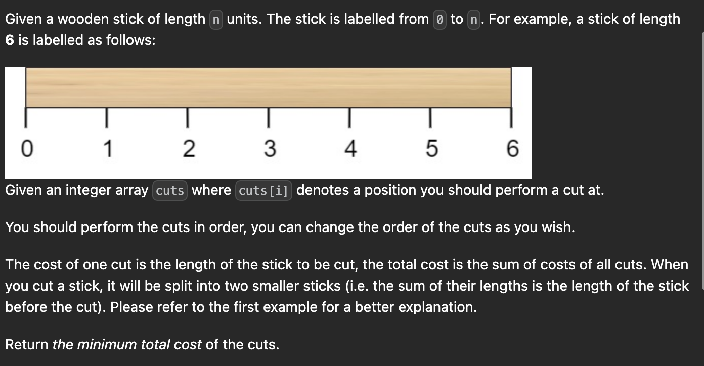

## 15-9 Breaking a string [CLRS]

A certain string-processing language allows a programmer to break a string into two pieces. Because this operation copies the string, it costs n time units to break a string of n characters into two pieces. Suppose a programmer wants to break a string into many pieces. The order in which the breaks occur can affect the total amount of time used. For example, suppose that the programmer wants to break a 20-character string after characters 2, 8, and 10 (numbering the characters in ascending order from the left-hand end, starting from 1). If she programs the breaks to occur in left-to-right order, then the first break costs 20 time units, the second break costs 18 time units (breaking the string from characters 3 to 20 at character 8), and the third break costs 12 time units, totaling 50 time units. If she programs the breaks to occur in right-to-left order, however, then the first break costs 20 time units, the second break costs 10 time units, and the third break costs 8 time units, totaling 38 time units. In yet another order, she could break first at 8 (costing 20), then break the left piece at 2 (costing 8), and finally the right piece at 10 (costing 12), for a total cost of 40.

Design an algorithm that, given the numbers of characters after which to break, determines a least-cost way to sequence those breaks. More formally, given a string S with n characters and an array $L[1 .. m]$ containing the break points, com- pute the lowest cost for a sequence of breaks, along with a sequence of breaks that achieves this cost

Similar problems:
[Leetcode - 1547. Minimum Cost to Cut a Stick](https://leetcode.com/problems/minimum-cost-to-cut-a-stick/) 

