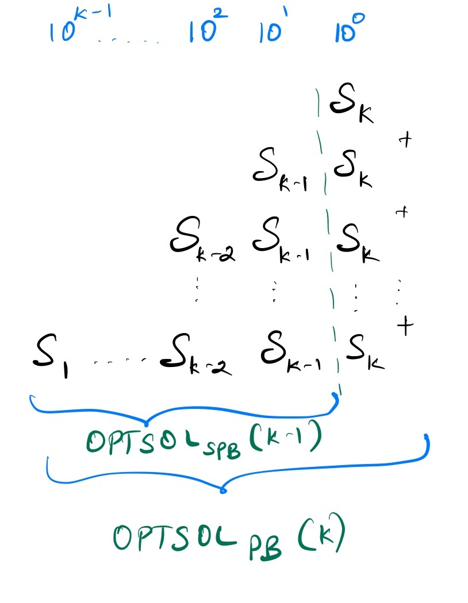

## Sum of all substrings cast as int

[Hackerrank](https://www.hackerrank.com/challenges/sam-and-substrings/problem)


Samantha and Sam are playing a numbers game. Given a number as a string, no leading zeros, determine the sum of all integer values of substrings of the string.

Given an integer as a string, sum all of its substrings cast as integers. As the number may become large, return the value modulo .
<strong>
Example
</strong>

Here  is a string that has  integer substrings: , , and . Their sum is , and .

Function Description

Complete the substrings function in the editor below.

substrings has the following parameter(s):

string n: the string representation of an integer
Returns

int: the sum of the integer values of all substrings in , modulo 
Input Format

A single line containing an integer as a string, without leading zeros.

<strong>Constraints</strong>

Sample Input 0
<pre>
16
</pre>
Sample Output 0
<pre>
23
</pre>
Explanation 0

The substrings of 16 are 16, 1 and 6 which sum to 23.

Sample Input 1
<pre>
123
</pre>
Sample Output 1
<pre>
164
</pre>
Explanation 1
<pre>
The substrings of 123 are 1, 2, 3, 12, 23, 123 which sum to 164.
</pre>


### Solution

Let the string $S$ be $s_1 s_2 s_3 s_4 \dots s_n$

All the substrings of S are as follows:


So, all the possible substrings of a string $S$ is the list of all the substrings that ends with each characters of the string $S$.

$substrings(S) = \displaystyle\{substringsEndsAt(s_i)\}_{ \displaystyle 1 \leq i \leq n}$

Hence the sum of all the substrings of the string $S$ casted as integer is equal to the sum of the substrings that ends at $i = 1, 2, \dots n$ casted as integer.

#### Optimal Substrubture:
Consider the optimal solution to the problem of finding the sum of all the substrings that end at some index $k$ (character is $s_k$).  

If we break the summands(all the substrings ends at $s_k$) to this problem at the least significant digit (rightmost digit) as shown below. 
The left part gives us the Optimal solution to the problem of finding the sum of all the substrings that end at index $(k-1)$ (character is $s_{k-1}$).



Hence the optimal solution to the problem of finding sum of all the substrings that ends at some index k is composed of the optimal solutions to the subproblems.

#### Constructing recursive function:
Let $sum[i]$ be the sum of the substrings that ends at index i. 
$sum[i] = sum[i-1] * 10 + i * int(s_i) \text{ where } 1 \leq i \leq n$ 
$sum[0] = 0$

Hence the sum of all the substrings of string $S$ casted as integer is as follows 

$$sum(substrings(S)) = \displaystyle\sum_{i = 1}^{n} sum[i-1] * 10 + i * int(s_i)$$


```
sum_substrings(S) {
    n = S.length()

    sum_substr_ends_at_i = 0
    total = 0
    
    for i = 1 to n:
        sum_substr_ends_at_i = (sum_substr_ends_at_i * 10) + ((i+1) * int(number[i]))
        total += sum_substr_ends_at_i

    return total
}   
```

### Time complexity

$T(n) = \theta(n)$

### Space complexity
$\theta(1)$