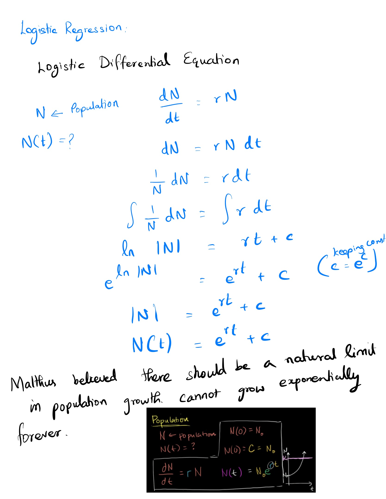
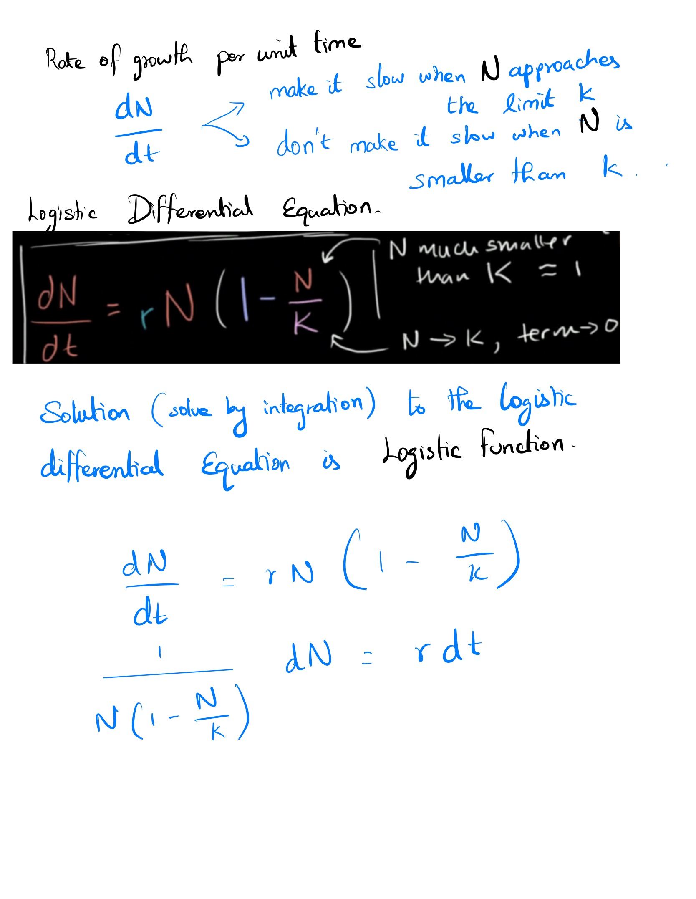
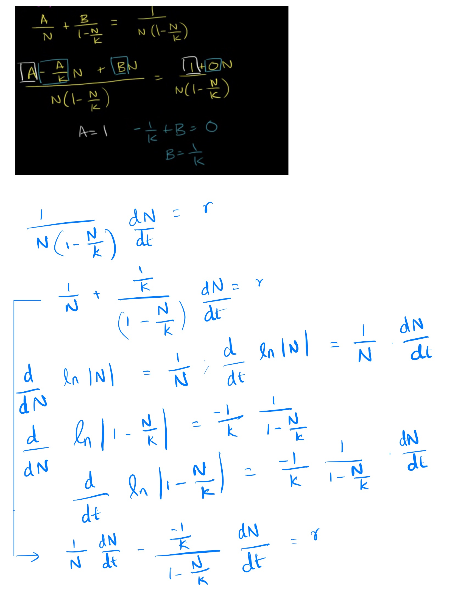
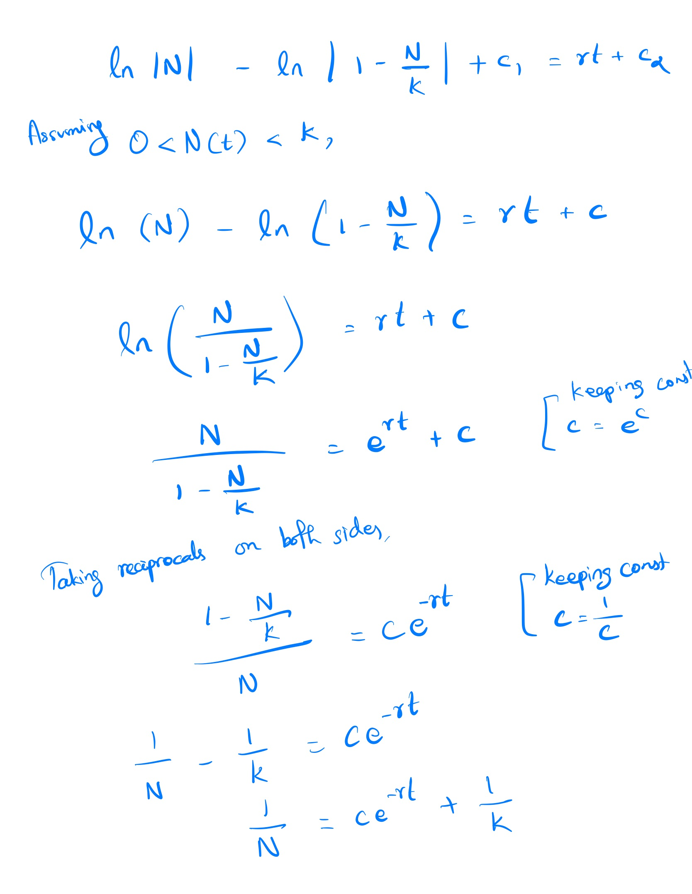
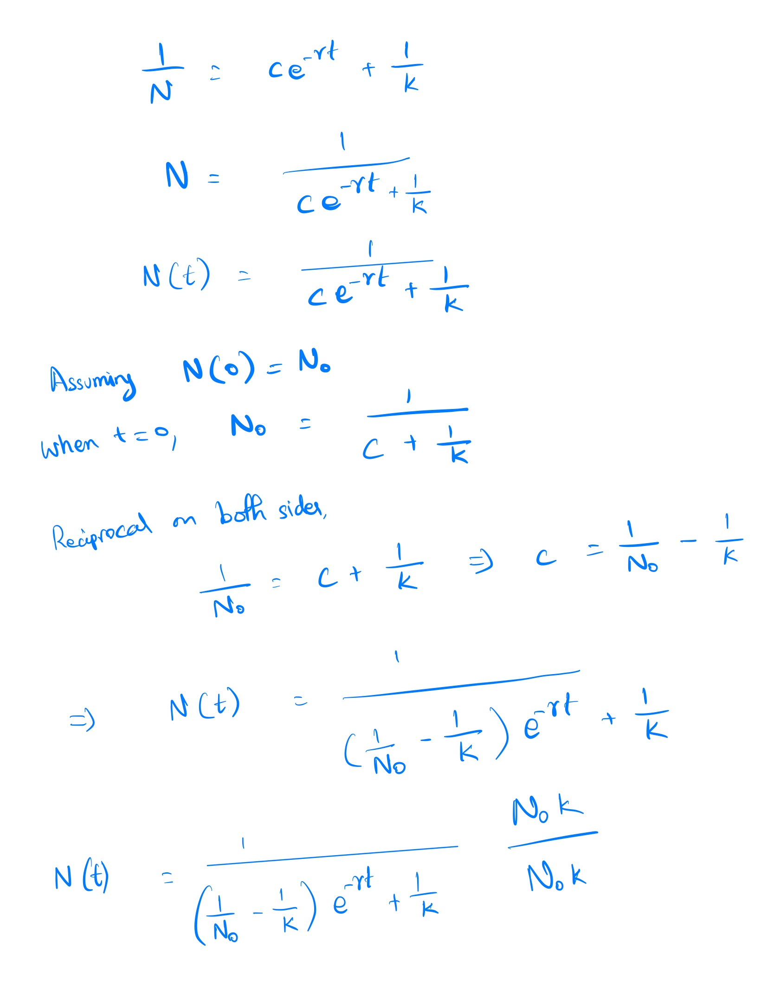
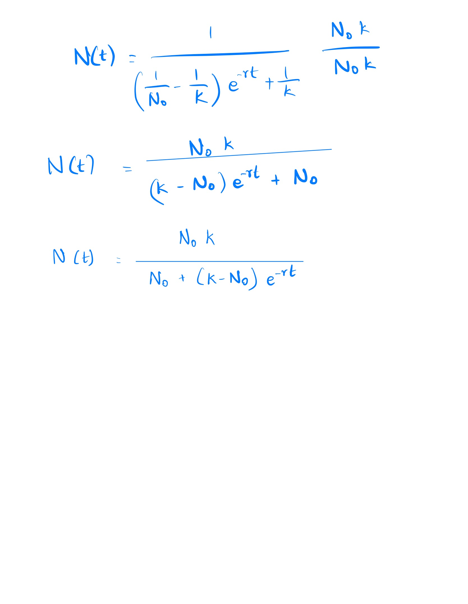
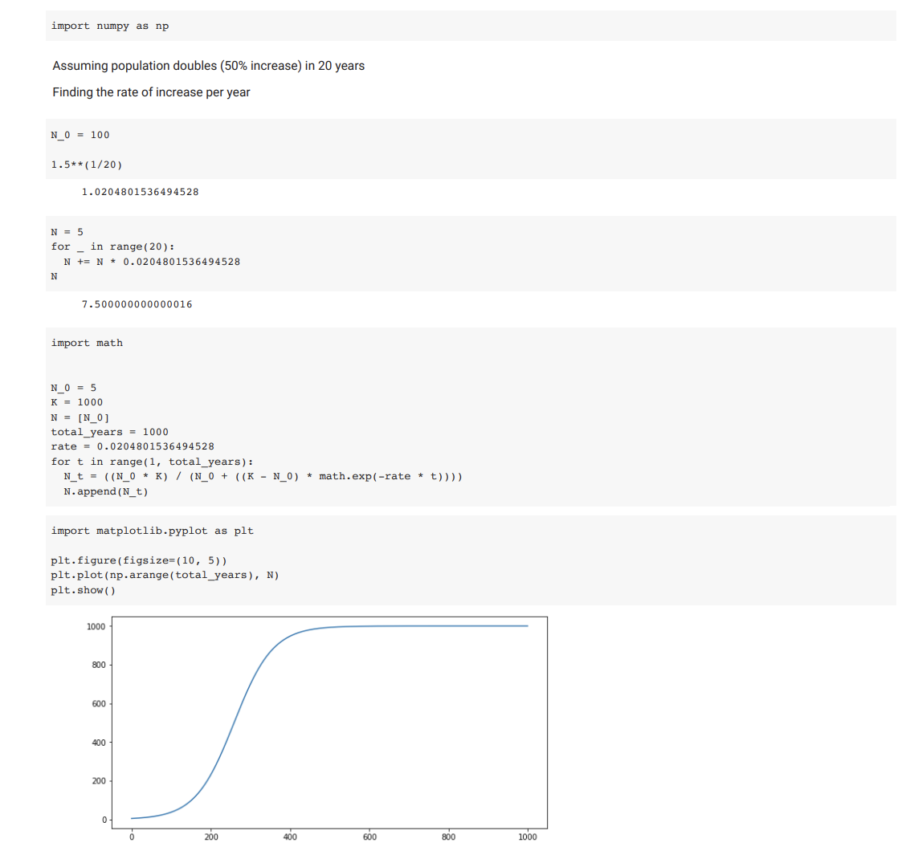

We could approach the classification problem ignoring the fact that y is discrete-valued, and use our old linear regression algorithm to try to predict y given x. However, it is easy to construct examples where this method performs very poorly. Intuitively, it also doesn’t make sense for $h​_\theta(x)$ to take values larger than 1 or smaller than 0 when we know that $y \in {0, 1}$. To fix this, let’s change the form for our hypotheses  $h_\theta(x)$ to satisfy $0 \leq h_\theta(x) \leq 1$. This is accomplished by plugging $\theta^T x$ into the Logistic Function.

The function g(z), shown here, maps any real number to the (0, 1) interval, making it useful for transforming an arbitrary-valued function into a function better suited for classification.

$h_\theta(x)$ will give us the probability that our output is 1. For example, $h_\theta(x)=0.7$ gives us a probability of 70% that our output is 1. Our probability that our prediction is 0 is just the complement of our probability that it is 1 (e.g. if probability that it is 1 is 70%, then the probability that it is 0 is 30%).

## Logistic Function:

### History
1830-1850 - under the guidance of Adolphe Quetelet,  Pierre François Verhulst developed the logistic function. It was developed for the purpose of modeling population growth.
1833 - logistic function was independently developed in chemistry as a model of autocatalysis by Wihelm Ostwald.

### Logistic Function derived from Logistic Differential Equation
### Generalized Logistic Function

