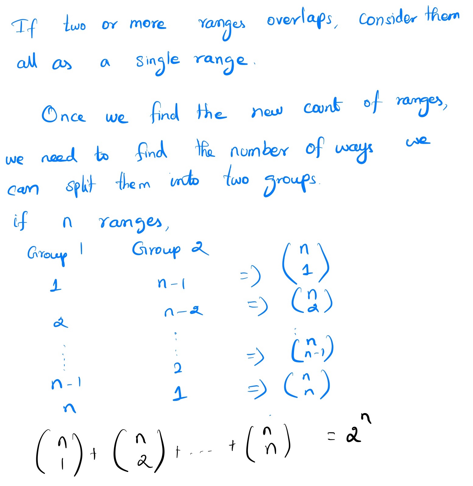

## 2580. Count Ways to Group Overlapping Ranges
[Leetcode](https://leetcode.com/contest/biweekly-contest-99/problems/count-ways-to-group-overlapping-ranges/)

              
You are given a 2D integer array <code>ranges</code> where <code>ranges[i] = [starti, endi]</code> denotes that all integers between <code>starti</code> and <code>endi</code> (both <strong>inclusive</strong>) are contained in the <code>ith</code> range.

You are to split <code>ranges</code> into <strong>two</strong> (possibly empty) groups such that:

<ul>
	<li>Each range belongs to exactly one group.</li>
	<li>Any two <strong>overlapping</strong> ranges must belong to the <strong>same</strong> group.</li>
</ul>

Two ranges are said to be <strong>overlapping</strong>&nbsp;if there exists at least <strong>one</strong> integer that is present in both ranges.

<ul>
	<li>For example, <code>[1, 3]</code> and <code>[2, 5]</code> are overlapping because <code>2</code> and <code>3</code> occur in both ranges.</li>
</ul>

Return <em>the <strong>total number</strong> of ways to split</em> <code>ranges</code> <em>into two groups</em>. Since the answer may be very large, return it <strong>modulo</strong> <code>109 + 7</code>.

&nbsp;

<strong class="example">Example 1:</strong>

<pre><strong>Input:</strong> ranges = [[6,10],[5,15]]
<strong>Output:</strong> 2
<strong>Explanation:</strong> 
The two ranges are overlapping, so they must be in the same group.
Thus, there are two possible ways:
- Put both the ranges together in group 1.
- Put both the ranges together in group 2.
</pre>

<strong class="example">Example 2:</strong>

<pre><strong>Input:</strong> ranges = [[1,3],[10,20],[2,5],[4,8]]
<strong>Output:</strong> 4
<strong>Explanation:</strong> 
Ranges [1,3], and [2,5] are overlapping. So, they must be in the same group.
Again, ranges [2,5] and [4,8] are also overlapping. So, they must also be in the same group. 
Thus, there are four possible ways to group them:
- All the ranges in group 1.
- All the ranges in group 2.
- Ranges [1,3], [2,5], and [4,8] in group 1 and [10,20] in group 2.
- Ranges [1,3], [2,5], and [4,8] in group 2 and [10,20] in group 1.
</pre>

&nbsp;

<strong>Constraints:</strong>

<ul>
	<li><code>1 &lt;= ranges.length &lt;= 105</code></li>
	<li><code>ranges[i].length == 2</code></li>
	<li><code>0 &lt;= starti &lt;= endi &lt;= 109</code></li>
</ul>

## Solution

